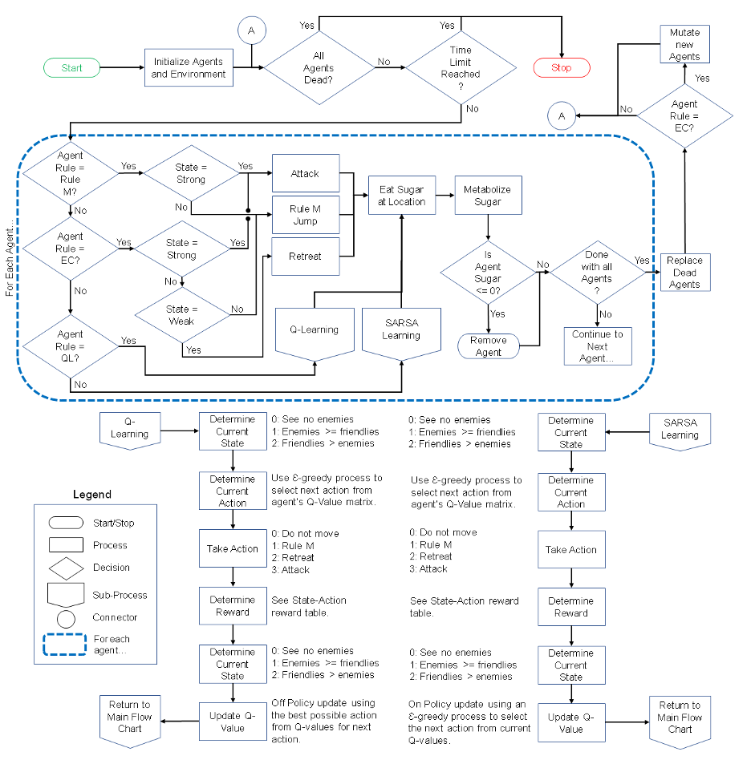

# Creating Intelligent Agents

Copy of the code and ODD oringally uploaded to <https://www.comses.net/codebase-release/707217f6-dc51-4161-9184-8fbb31fb256d/>

## Full Reference

**Brearcliffe, D.K. and Crooks, A.T. (2020)**, Creating Intelligent Agents: Combining Agent-Based Modeling with Machine Learning, *The 2020 Computational Social Science Society of Americas Conference*, Online. [pdf](Creating_Intelligent_Agents_CSSSA2020.pdf)

## Abstract

"Over the last two decades with advances in computational availability and power, we have seen a rapid increase in the development and use of Machine Learning (ML) solutions applied to a wide range of applications, including their use within agent-based models. However, little attention has been given to how different ML methods alter the simulation results. Within this paper, we discuss how ML methods have been utilized within agent-based models and explore how different methods affect the results. We do this by extending the Sugarscape model to include three ML methods (evolutionary computing, and two reinforcement learning algorithms (i.e., Q Learning, and State→Action→Reward→State→Action (SARSA)). We pit these ML methods against each other and the normal functioning of the rule-based method (Rule M) in pairwise combat. Our results demonstrate ML methods can be integrated into agent-based models, that learning does not always mean better results, and that agent attributes considered important to the modeler might not be to the agent. Our paper's contribution to the field of agent-based modeling is not only to show how previous researchers have used ML but also to directly compare and contrast how different ML methods used in the same model impact the simulation outcome, which is rarely discussed thus, helping bring awareness to researchers who are considering using intelligent agents to improve their models."

**Keywords**: Agent-based Modeling, Evolutionary Computing, Machine Learning, Reinforcement Learning, Sugarscape.

## Whats Here?

* [The NetLogo Model (NetLogo 6.1.0)](Creating_Intelligent_Agents.nlogo)
* [The modified Sugarscape map](symmetric-sugar-map.txt)
* [The ODD of the Model](CreatingIntelligentAgentsODD.pdf)
* [The Paper](Creating_Intelligent_Agents_CSSSA2020.pdf)

## Example Figure

**Model execution flowchart.:**

## Example Model Run

